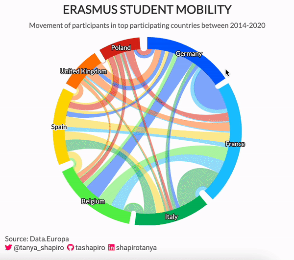

# Highcharter Graphics

[**Highcharter**](https://jkunst.com/highcharter/) is an R wrapper package [highcharts](https://www.highcharts.com/) (javascript) and was developed by Joshua Kunst. In this repository, I will share code on how to create some basic plots with {highcharter} in R.

## Dependency Wheel - Erasmus Students

Example of a dependency wheel graphic. Data taken from [#TidyTuesday](https://github.com/rfordatascience/tidytuesday/blob/master/data/2022/2022-03-08/readme.md), graphic shows flow of students participating in the Erasmus Program from country to country.

